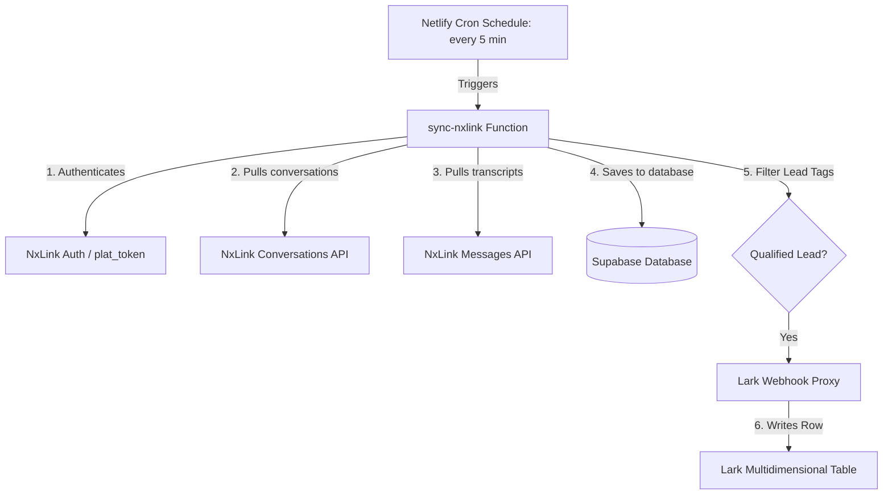

# Tenant Integration Duplication Guide

This guide provides step-by-step instructions on how to replicate the NxLink and Lark integration for other tenants. It covers the overall architecture, system requirements, credentials checklist, and verification procedures.

---

## 1. Integration Architecture & Data Flow

The integration runs serverless workflows using **Netlify Functions** and **Supabase** to sync NxLink conversation records to a **Lark Multidimensional Table**.



### Components:
- **`sync-nxlink-cron.ts`**: A Netlify background scheduled function that runs every 5 minutes (`*/5 * * * *`).
- **`sync-nxlink.ts`**: The core synchronization logic. It:
  - Connects to the NxLink admin endpoints to retrieve conversations and messages.
  - Parses metadata (Sentiment, Summary, Next Steps, Name, Phone, and Call Audio URLs).
  - Synchronizes records to the Supabase database.
  - Automatically pushes qualifying leads (based on tags) to the Lark Webhook.
- **`push-webhook.ts`**: A secure proxy forwarding payloads to Lark with signature credentials to hide secrets from client scripts.
- **`ingest-crm.ts`**: An alternative inbound API endpoint allowing other systems to push raw conversation text payloads which are then parsed and stored.

---

## 2. Requirements & Prerequisites

To set up a new tenant integration, you need access and configuration prepared across three platforms:

### A. NxLink Requirements
- **Tenant Target URL**: E.g., `https://app.nxlink.ai` (default) or other tenant endpoints like `https://idn.nxlink.ai`.
- **Flow Filter Name**: The synchronization script searches for a specific string in the conversation's flow name (e.g., `'dentalhome'`). Determine the identifier for the new tenant's flow.
- **Authentication**: A valid `plat_token` is required. This can be obtained in two ways:
  1. **Token Service**: A shared endpoint (`NXAI_TOKEN_URL`) returning the token.
  2. **Headless Login (Preferred Fallback)**: An admin account email and password stored in a local `.nxlink_creds` file. The python script [`nxlink_get_plat_token.py`](file:///Users/bryantlim/Documents/chillor-repo/nxlink-crm/nxlink_get_plat_token.py) uses Playwright to programmatically login and scrape a fresh token.

### B. Lark Requirements
- **Lark Multidimensional / Base Table**: Create a table in Lark to store leads.
- **Fields Configuration**: Ensure the table has columns that match the webhook payload key names exactly:
  - `Conversation ID` (Text)
  - `Customer Name` (Text)
  - `Phone Number` (Text)
  - `Company Name` (Text/Null)
  - `Email Address` (Text/Null)
  - `Tags` (Multi-select or Text array)
  - `Full Summary` (Text)
  - `Sentiment` (Text)
  - `Next Steps` (Text)
  - `Call Audio URL` (Link/Text)
  - `Conversation Date` (Date/Text)
- **Lark Webhook URL**: Set up a multidimensional table webhook trigger on Lark and retrieve the URL.
- **Lark API Client Credentials**: Create a Lark custom app/webhook credential to obtain a `client_id` and `client_secret` to authorize webhook POST requests.

### C. Supabase Database Requirements
- **Supabase Instance**: Set up a Supabase project for the tenant.
- **Database Schema**: Execute [`supabase_schema.sql`](file:///Users/bryantlim/Documents/chillor-repo/nxlink-crm/supabase_schema.sql) in the Supabase SQL editor to create the following tables:
  - `conversations`: Stores conversation transcripts, summaries, tags, metadata, and webhook sync statuses.
  - `customer_profiles`: Consolidated profiles of customers keyed by phone number.
  - `profiles`: Internal user roles and authentication mapping.
  - `webhook_logs`: Logging table for tracking inbound `ingest-crm` requests (if enabled).

---

## 3. Required Credentials Checklist

Keep these environment variables configured in Netlify's site settings under **Environment Variables** (or in a local `.env` file for testing):

| Env Variable | Description | Example / Usage |
|--------------|-------------|-----------------|
| `SUPABASE_URL` | Supabase API connection URL | `https://xxxx.supabase.co` |
| `SUPABASE_SERVICE_ROLE_KEY` | Service role key for bypass RLS limits | `eyJhbGciOi...` |
| `NXLINK_WEBHOOK_URL` | Lark webhook endpoint | `https://asia-east1-lark-demo-67aa3.cloudfunctions.net/...` |
| `NXLINK_WEBHOOK_CLIENT_ID` | Lark webhook credential Client ID | `nxw_41ef8e4dee35cd8e4c6c1d3e` |
| `NXLINK_WEBHOOK_CLIENT_SECRET`| Lark webhook credential Client Secret | `8ab7881cfcf9cd842827...` |
| `NXAI_TOKEN_URL` | (Optional) Shared token service endpoint | `https://asia-east1...` |
| `NXLINK_PLAT_TOKEN` | (Fallback/Testing) Hardcoded plat token | `eyJhbGciOiJIUzI1...` |

### Local Verification Credentials:
- **File Name**: `.nxlink_creds` (Place at project root. Do NOT commit this file).
- **Format**:
  ```
  username@company.com
  yourpasswordhere
  ```

---

## 4. Step-by-Step Duplication Guide

Follow these steps to replicate the integration for a new tenant:

### Step 1: Initialize Database Tables
Log in to the new tenant's Supabase dashboard, go to the **SQL Editor**, and run the schema setup from [`supabase_schema.sql`](file:///Users/bryantlim/Documents/chillor-repo/nxlink-crm/supabase_schema.sql).

### Step 2: Configure Lark Base and Webhook
1. Create your Lark Multidimensional Table with the column schema outlined in Section 2B.
2. Set up the Lark webhook connector and record the Webhook URL.
3. Configure signature validation inside Lark to acquire the Webhook **Client ID** and **Client Secret**.

### Step 3: Modify Codebase Filters (Tenant Customization)
1. Open [`sync-nxlink.ts`](file:///Users/bryantlim/Documents/chillor-repo/nxlink-crm/netlify/functions/sync-nxlink.ts) and locate the flow name filter on line 167:
   ```typescript
   const dhRecords = pageList.filter((c: any) => (c.auto_flow_name || c.autoFlowName || '').toLowerCase().includes('dentalhome'));
   ```
   Replace `'dentalhome'` with your new tenant's flow identifier.
2. Locate the line 198:
   ```typescript
   if (!flowName.toLowerCase().includes('dentalhome')) continue;
   ```
   Modify it to match the same tenant flow identifier.
3. Check [`sync-local.js`](file:///Users/bryantlim/Documents/chillor-repo/nxlink-crm/scripts/sync-local.js) and make the equivalent flow string updates if you plan to test locally.

### Step 4: Configure Netlify Environment Variables
1. Deploy the repository to a new Netlify project.
2. Go to **Site Configuration** > **Environment variables**.
3. Add all variables listed in the **Credentials Checklist** (Section 3).

### Step 5: Test the Setup Locally
1. Install requirements for the token scraper:
   ```bash
   pip install playwright --break-system-packages
   playwright install chrome
   ```
2. Create `.nxlink_creds` at the root with your NxLink login details.
3. Set up a local `.env` file containing your Supabase and Lark variables.
4. Execute the dry-run/local sync tool:
   ```bash
   node scripts/sync-local.js
   ```
5. Ensure conversations are written to Supabase and webhook payloads are successfully delivered to Lark.

### Step 6: Deploy and Monitor
1. Deploy the functions to Netlify. The Cron Scheduler will automatically activate the 5-minute sync schedule (`sync-nxlink-cron`).
2. Monitor output and debug errors by checking logs in the Netlify dashboard under **Serverless Functions** > `sync-nxlink-cron`.
